# Introduction

## Contexte

<!--TODO: motivations-->
[motivations](motivations)

# Nos objectifs
Notre objectif est de  céer une interface de lecture thématique pour les textes historiques.
Plus spécifiquement notre objectif se réalisera sur ces deux fronts.
Premièrement, il nous faut créer un graphe de connaissances (ontologie) pour indexer sémantiquement les textes.
Deuxièmement, nous allons développer un système de "requête" pour naviguer dans le graphe de connaissances et accéder aux textes.

## Méthodologie

## Sources
Les historiens nous ont fournis une liste intéressante documents. Mais le type de fichier qui nous intéresse le plus est l'index. Nous nous sommes concentré sur le fichier d'index "Index_1543.docx". Le fichier est assez simple dans sa composition.

Nous avons d'abords une première section écrite avec en texte clair. Cette première section nous introduit le document parlant de son contenu et de la structure adopté dans l'écriture de l'index. Nous y avons trouvé des informations préciseuses pour l'élaboration de nos parseurs qui extrairons par la suite le contenu de ce document.
Nous avons ensuite l'index. Celui-ci relate les éléments classés par ordre alphabétique. Si la première partie contient du texte non structuré, nous nous retrouvons avec une deuxième partie qui contient des informations que nous somme capable d'extraire. 

La figure 1 illustre le pipeline utilisé pour le traitement des donnée ainsi que la partie concernant notre interface de requête.

<!--TODO: put numbers in each box-->
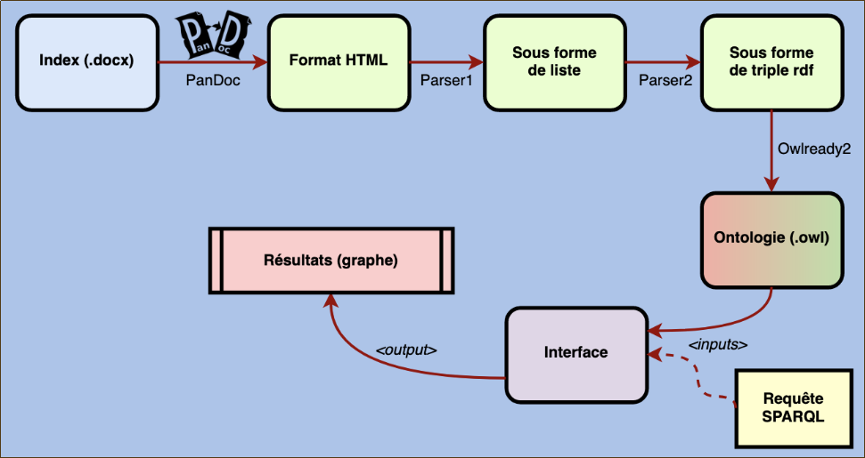

## Conversion du fichier word en fichier html
Premièrement, le format du  fichier d'index est changé du format word (.docx) au format html. Nous avons décidé d'utiliser l'outil [Pandoc](https://pandoc.org/) qui est une sorte de convertisseur universel de différents type de fichier de documentation. Cette étatpe est la plus facile du processus puisque nous utilisons un outils déjà existant.

## Conversion du fichier html en structure python
À partir du fichier HTML obtenu, des données structurés de python (sous la forme de liste) sont alors extraits pour des traitements supplémentaires. Ici nous utilisons un parseur construit par nos soins pour obtenir ces structures. Notre tentative est seulement de transformer le typage syntaxique en typage structurel. Ainsi les éléments stylistiques comme la mise en gras ou l'usage d'italiques vont laisser place à des étiquettes qui définiront les termes de façon plus régulière et donc traitable par une machine. Nous avons utilisé les définitions données au début de la fiche d'index. Voici un tableau qui illustre les correspondance établies.

| style            | étiquette  | signification           |
|------------------|------------|-------------------------|
| gras             | common_new | nom commun contemporain |
| italique         | Place      | Lieux et cours d'eau    |
| petite majuscule | Personne   | Nom de personne         |

## Conversion des structures python en triplets
Dans cette nouvelle étape, les données structurées (sous forme de liste python) vont être traités sémantiquement par un bloque de code pour produir une suite de triplets rdf. Ici nous faisons en sorte de déplier toutes les sous structure pour avoir un rendu plus linéaire. C'est aussi dans cette phase de dépliage que nous pouvons appliquer d'autre parseurs pour extraire d'avantage d'information sur les entités. Par exemple nous pouvons obtenir plus d'information sur les éléments contenant une parenthèse ou des information entre crochet. Après cela, nous finission avec un groupe d'élément (terme+type).le premier terme va être lié aux autres termes par des propriétés établies au préalable pour donner des triplets.

## Conversion des triplets en base rdf
Dans cette dernière partie, nous finalisons notre ontologie. Nous utilisons le module python owlready2. Il suffit maintenant de joindre ces triplets avec l'ontologie que nous avons déjà créé pour obtenir une nouvelle ontologie contentant les classes, ainsi que les propriétés et entités. Les entités, propriétés et les liens entre entités sont construit à mesure que les triplets sont scannés.

Cette nouvelle ontologie va servir de base de données pour notre interface graphique qui va faire des requêtes de type SPARQL pour obtenir le contenu de ces données. Données qui vont être présentées sous forme de graphe ou de tableau.
<!-- TODO: changer le diagramme pour mettre entre prarentèse grape *et tableau*. -->

## Travaux connexes:
Nous avons fait une recherche sur les travaux connexes et avons trouver des informations intéressantes sur des outils allants dans la même direction que nous. Nous entendons par là des outils capable de traîter des données semis strcuturées pour pouvoir obtenir des données sous la forme de triplets.

Noms de l'Article:
Review of Tools for Semantics Extraction: Application in Tsunami Research Domain

Le cas de cette études s'intéresse aux recherches axées sur les Tsunamis.

# Ontologie
Après une observation et une étude minutieuse de la fiche d'index, nous avons pu dégager quelques outils pratiques pour l'élaboration d'une ontologie représentative. Ici nous nous intéressons plus particulièrement aux classes. Nous avons établies différentes classes importantes à nos yeux. Nous avons dégagés les classes liées au personnes, les classes liées aux localisations ainsi qu'une classe lié à toutes les unités étatiques et une classes concernant les écrits par lequel l'index fait ses références.

Hiérarchie des classes.

## Classes liées aux personnes

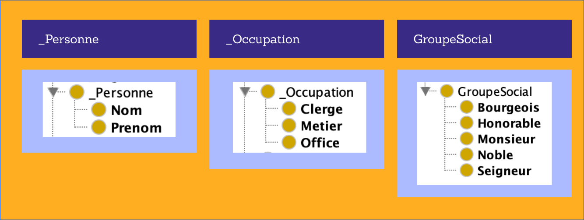

<!--TODO: pourquoi il y a un underscore en dessous de certaines classes?-->

Nous avons jugé pertinant de prendre les classes liées aux personnes. Nous avons créé les classe Personnes, Occupation et GroupeSocial.

## Classes liées aux localisations

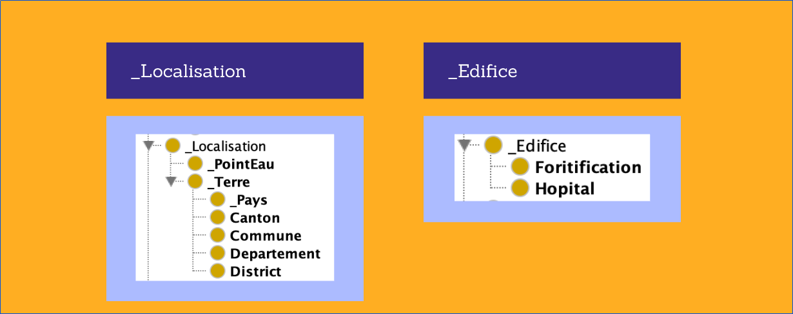
La localisation et les lieux sont aussi un aspect intéressant de ces registres, en effet, nous sommes en mesures de pouvoir répondre à la question "où". Nous avons construit la classe localisation et la classes Edifice.

## Classe liée à l'état

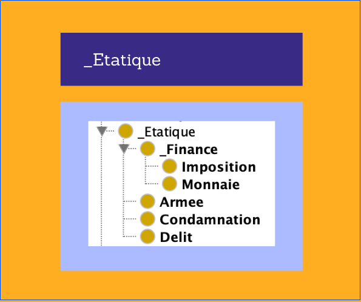

<!--TODO: continuer ici-->

## Les autres pages
Ecrit
_Page

# Algorithmes 
## Données
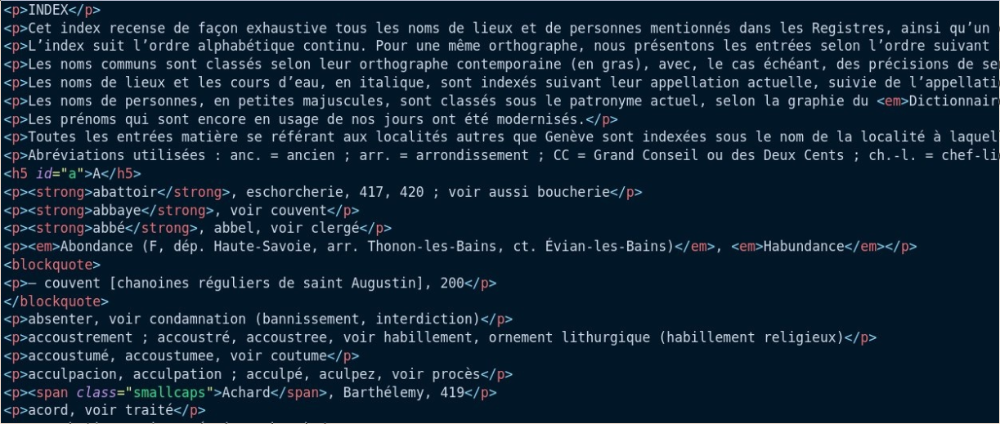

## To_HTML 

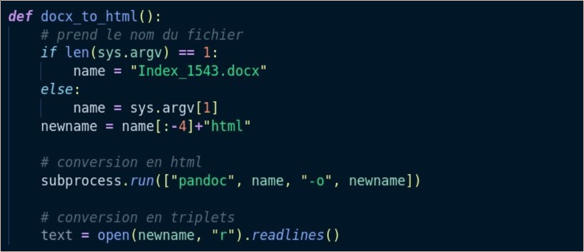

## To_Triplet

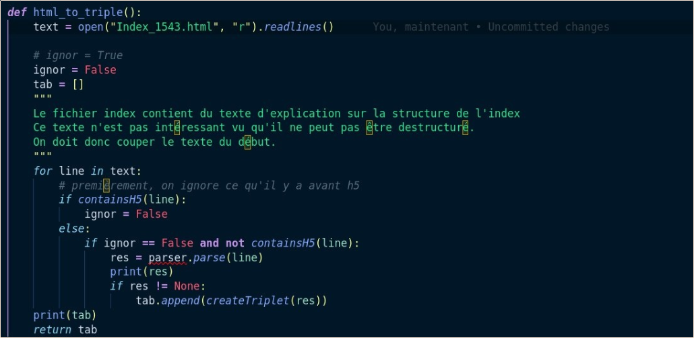

## To_Owl 

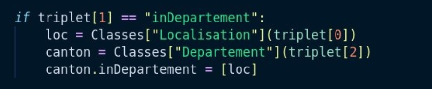

# Résultats

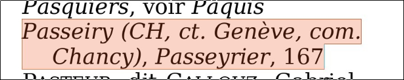

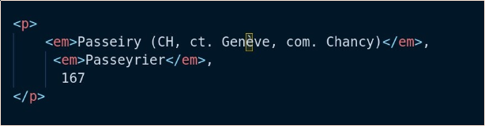

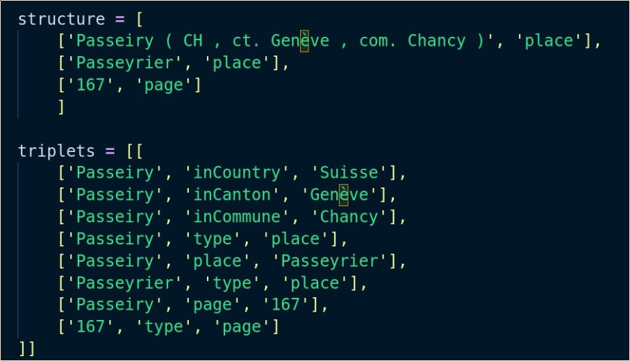

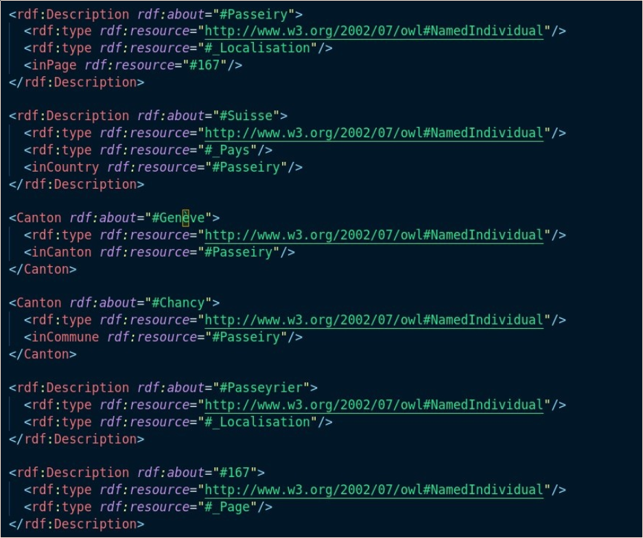

# Interface

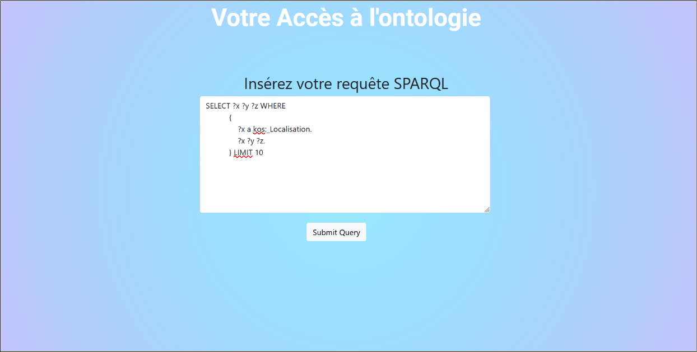

---

# Conclusion

## Difficultés rencontrées

- Complications à comprendre l'index: notations, structure, etc.
- Parsing...:
	- Erreures humaines dans les indexs: fautes de frappe
	- Caractères apparaissant en dehors des balises html
- Termes  utiliser pour les classes de l'ontologie
- Travail manuel à faire pour parcourir l'index manuellement

# Amelioration et la suite
- Parser: ajouter les propriétés manquantes
- web-app:
	- Ajouter une table des résultats pour que l'utilisateur puisse voir les résultats
	- Ajouter un wrapper pour éviter aux utilisateurs de devoir taper des requêtes SPARQL
- Utiliser SpaCy (Librairie Python) pour aider le parser
- Ontologie: Ajout de classes supplémentaire -> Davantage compléter l'ontologie

<!--TODO: Demander les références-->

